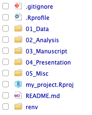
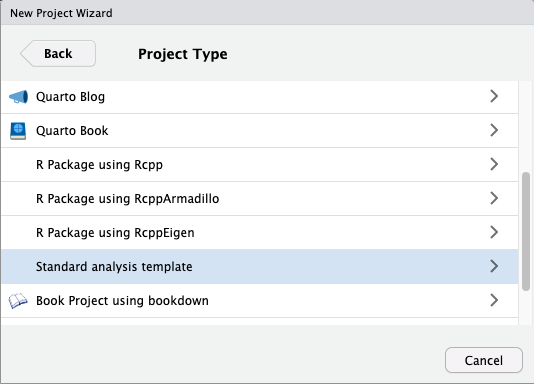

# The analysistemplates package

The RStudio projects of your colleagues all have a different structure? It is
difficult to navigate and understand others' projects? Or even your own project
from a few months/years ago? Therefore, it is useful
if you all agree on a standard folder structure for your analysis. Templates can
help to enforce this. Currently, this package provides one standard data analysis
template for RStudio projects geared towards scientific use cases. Whenever you
start a new project in RStudio, this package provides the standard folder structure
directly in your code editor. Also, it can help you improving reproducibility by
using git and `renv`.



## Installation

``` r
remotes::install_github("jonas-hag/analysistemplates")
```

## Usage

To create a new project with the folder structure shown below, follow these steps:

1.  Install the package
2.  Restart RStudio
3.  When creating a new RStudio project with the "New directory" option, choose "Standard analysis template"

    

4.  During initialization you can select if a folder called `06_Analysis_for_publication` is included (check "Include Analysis for publication folder")
5.  You can select if you want to generate a `.gitignore` file (check "Create a .gitignore file")
6.  You can select if you want to use `renv` (check "Use renv with this project")
7.  Once you've created the project, you will be provided with the instructions how to create a git repository for your project and connect to github/gitlab

## Template overview

A new project contains the following folder structure:

```
|-- 01_Data
|   |-- 01_Raw
|   `-- 02_Clean
|-- 02_Analysis
|   |-- 01_Scripts
|   |-- 02_Results
|   |-- 03_Figures
|   `-- 04_Tables
|-- 03_Manuscript
|   |-- 01_Text
|   `-- 02_Final_figures
|-- 04_Presentation
|-- 05_Misc
|-- 06_Analysis_for_publication <-- optional
|   |-- 01_Scripts              <-- optional
|   |-- 02_Results              <-- optional
|   |-- 03_Figures              <-- optional
|   `-- 04_Tables               <-- optional
|-- README.md
|-- .gitignore                  <-- optional
|-- renv                        <-- optional
```
## Planned features

- better integration with git/github

## I want a different template

You can easily create your own template. Fork this repo and create a new pair of
`<my_template>.R` and `<my_template>.dcf` files. `<my_template>.dcf` defines
how your template is named and which options are shown when you select the
template in the project wizard. `<my_template>.R` defines what happens when the
template is used. Have a look at `standard_analysis.R` and `standard_analysis.dcf`
for inspiration or check out the [RStudio Extensions documentation](https://rstudio.github.io/rstudio-extensions/rstudio_project_templates.html).
